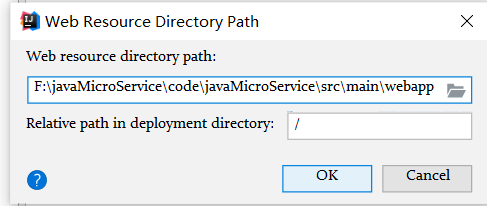
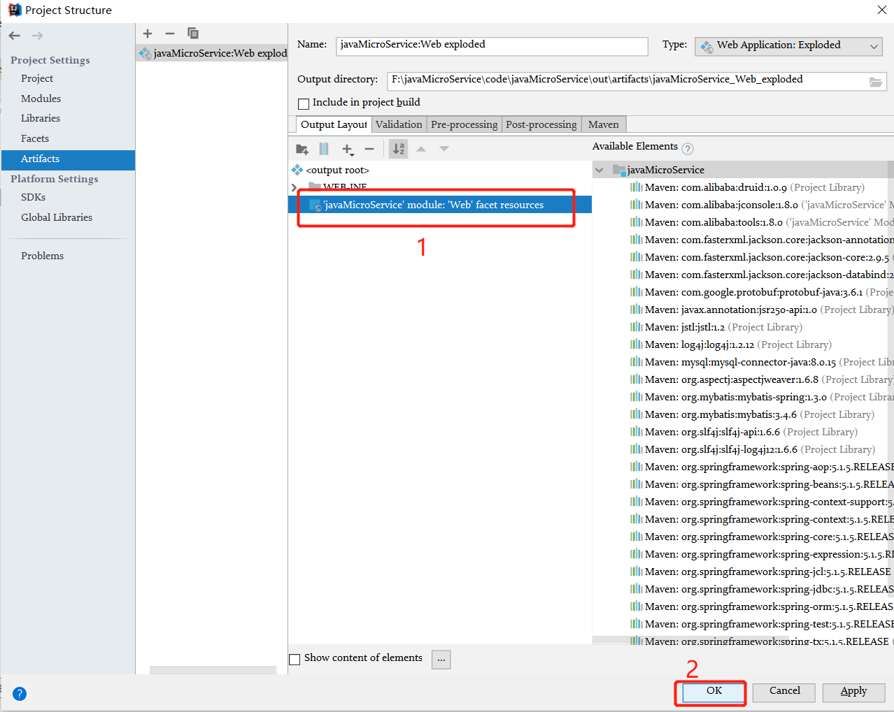

### 项目说明  
该项目是基于ssm，对一个2017年github项目的升级  

> 先保留，等到更新完成再详细讲解。  

### 项目进度  
- 2019/10/19 摈弃了10月初开发的code，做了如下修改。
  - 项目依赖管理完全交给maven，消除了手动导jar包的麻烦
  - 使用了阿里巴巴的德鲁伊数据库连接池，对比c3p0，初次启动起来更慢，但建立连接反应更快
  - 虽然使用idea开发，但采用了传统的javaweb的目录结构，搞成这个目录结构需要一定的配置。idea如何配置会在后面列出。
- 2019/10/20 添加一个分支，作为springboot的源码开发，项目结束后会merge。

#### idea下maven，spring项目的开发

1. 创建不带骨架的maven项目

2. 配置工程文件的maven为自己的maven

3. 复制粘贴ssm需要的maven坐标

4. 修改路径

   1. 
   2. 
   3. 
   4. 复制后面这一段，这一段是必须的

   

   5. 
   6. 一直选到你项目下的main

   

   7. 手动添加下面路径

      

> webapp或webapps

		8. 然后再粘贴

9. 1. 
10. 

​	由于还报警告

​	还要再改一个地方

11. 
12. 

13. 
14. 
15. 
16. 项目目录结构

