# 1.用例图

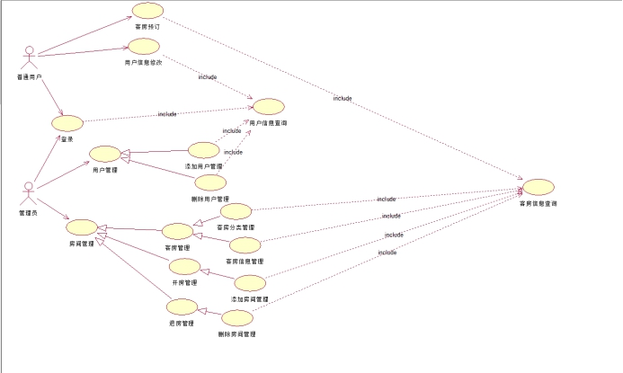 

# 2.活动图(也叫流程图)

## 登录用例的活动图

 

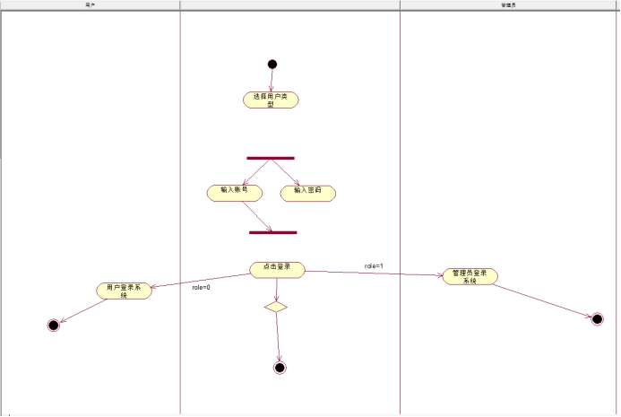 

## 预订房间用例活动图

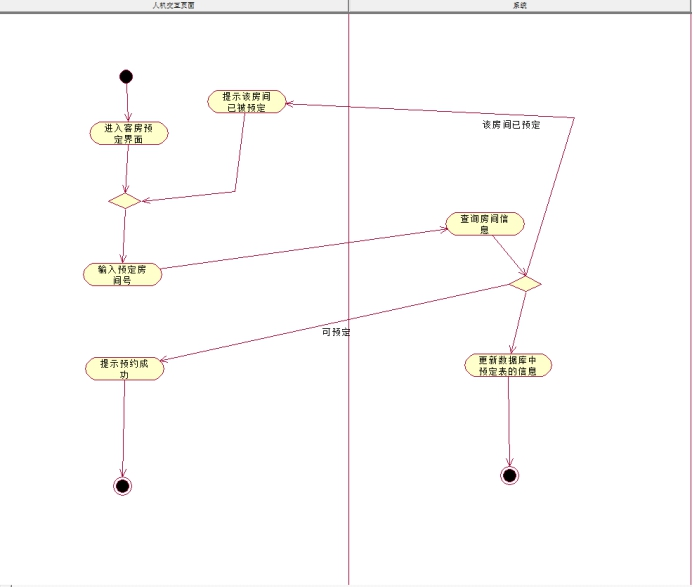 

## 开房管理用例流程图

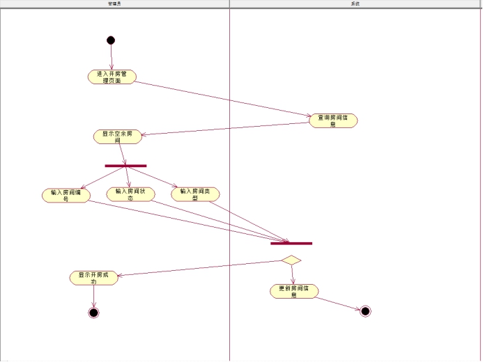 

 

 

 

## 房间管理活动图：

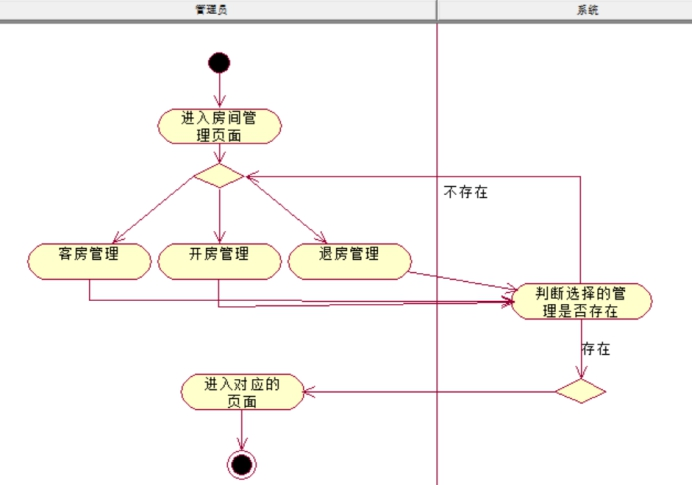 

## 客房管理活动图：

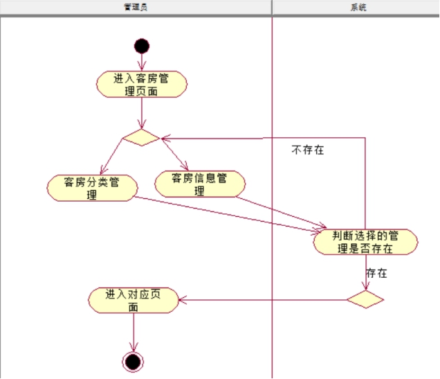 

## 客房分类管理活动图：

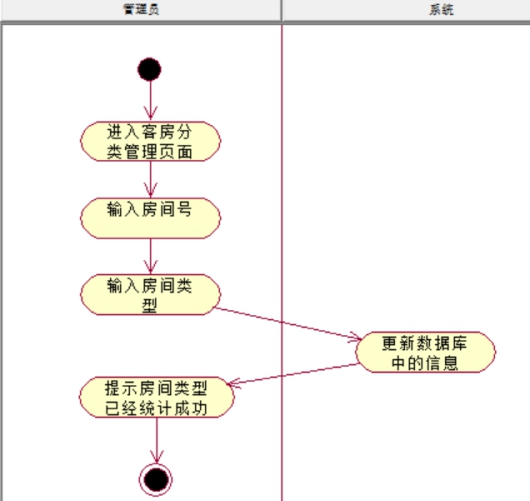 

## 客房信息管理活动图：

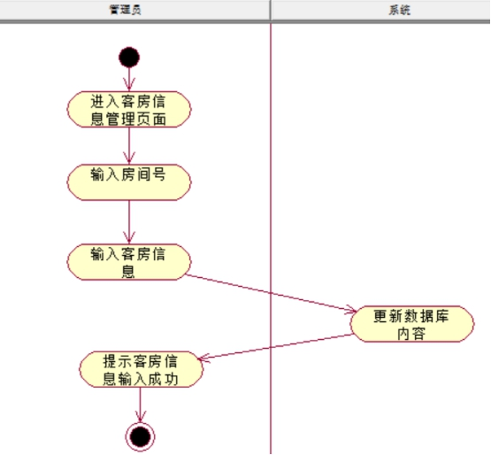 

## 添加房间管理活动图

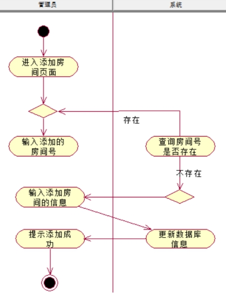 

 

## 删除房间管理活动图： 

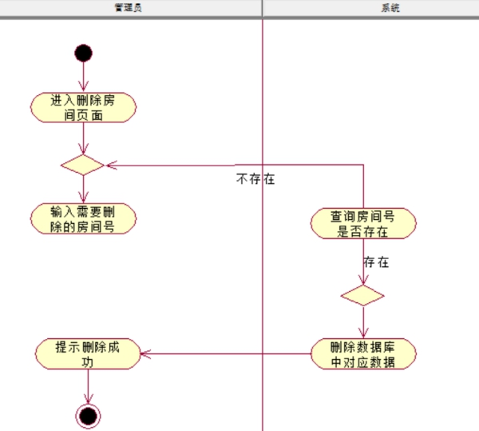 

## 退房管理活动图：

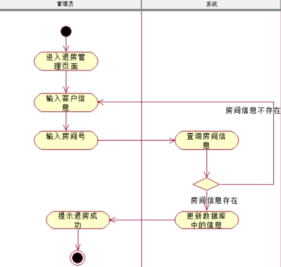 

## 客房信息查询活动图：

 

## 用户管理活动图：

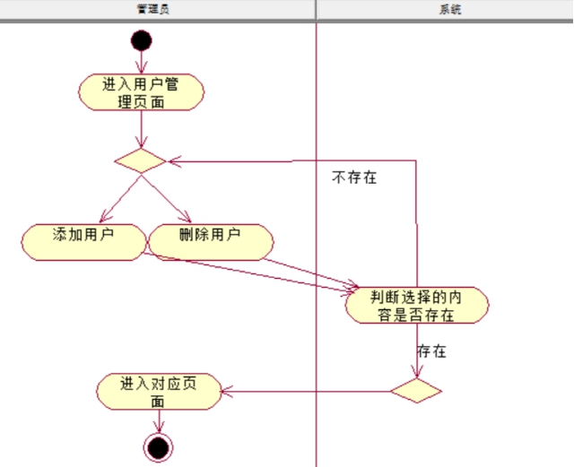 

## 添加用户活动图：

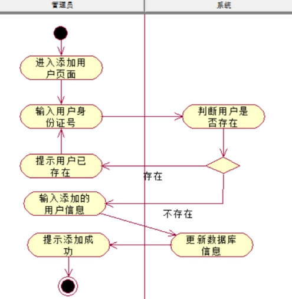 

## 删除用户活动图：

 

## 用户信息查询活动图

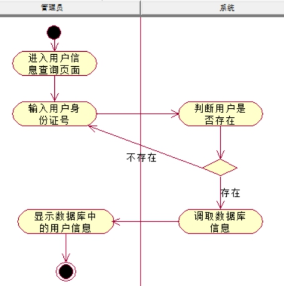 

## 用户信息修改活动图

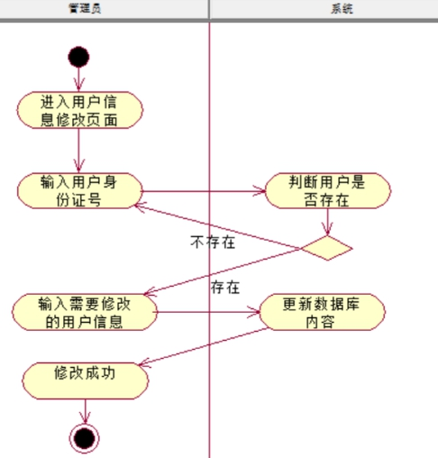 

 

 

 